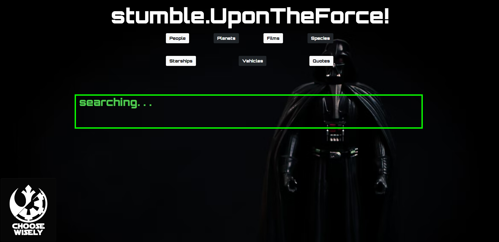

# <Stumble-Upon-the-Force>

## User Story

```
AS a user and fan of Star Wars, 
I WANT to educate my friend (AJ)
SO THAT he can know the wonderful world of Star Wars.


## Description

**Stumble upon the Force** Is a webpage that contains a random trivia generator and a random quote generator. We're building this project to teach people facts about Star Wars, including one of our own team members. This should help people new to the series learn more about different aspects of the series, such as trivia on characters, planets, spaceships, and other such topics in the series.

-When a user enters the web application, they see a page with seven buttons; People, Planets, Films, Species, Vehicles, Starships, and Quotes. 
-When clicked, these buttons will choose at random from that category and display them on the screen. 
-The Quotes category will display in a different element and not interfere with the displaying of the other categories.
-The User can click the buttons as many times as they like and continue to see information.
-The User has an option to submit their email and select whether they would like to align with the "Rebels" or the "Empire." This feature would allow the site moderator to create a database of fans and send them content via email.
-There is also a feature that presents a logo for the faction that the user chooses and displays it on the screen. Whenever the user refreshes the page, they will still see this logo unless they "enlist" with the other faction. 

-Creating the application was enlightening in several ways.
-We learned that not all APIs are reliable. As we used the SWAPI, we would receive 404 returns even when our formating was correct. The website said that it was no longer maintained, and we believe this to likely be why.
-We learned that some APIs will cause problems because they are not on a secure server. When using the swquotesAPI, we found that the users browser would not allow the url unless it was pulled up on the browser first and the site was approved. 

screenshot


    


## Credits

- Peter Riggs: https://github.com/Par92
- Kyle Henriksen: https://github.com/starbjornx
- AJ Shea: https://github.com/AJShea86
- Jay Lee: https://github.com/SangJin95
- Third Party APIs
  - SWAPI (Star Wars API): https://swapi.dev/
  - Star Wars Quotes API: http://swquotesapi.digitaljedi.dk
